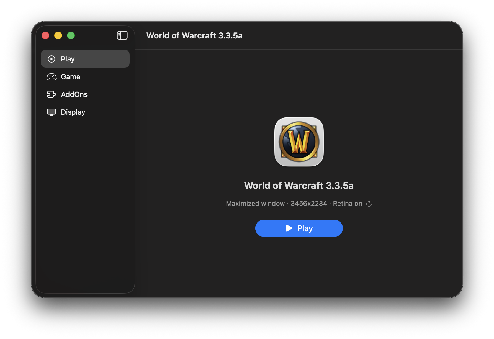
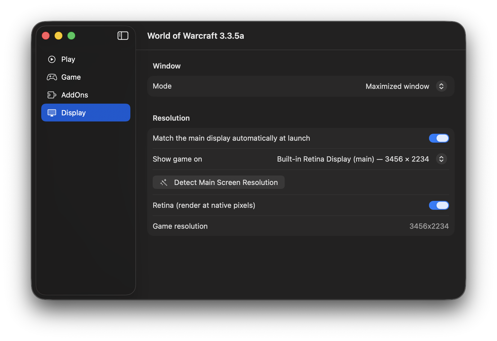
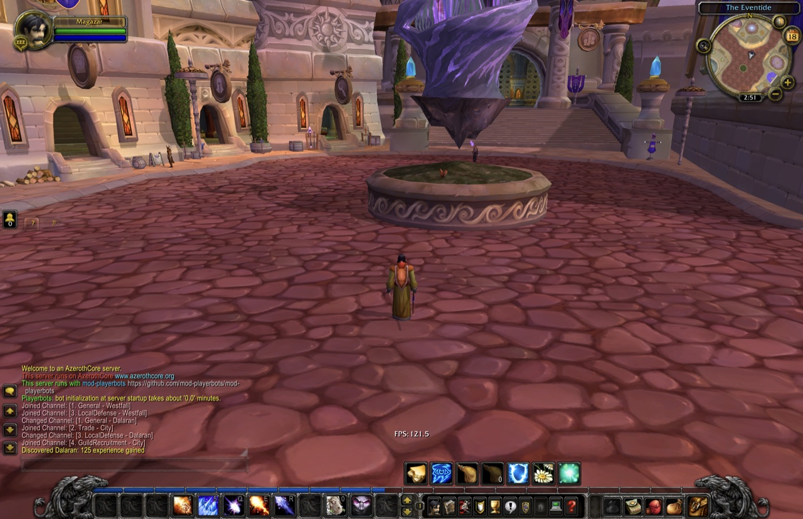
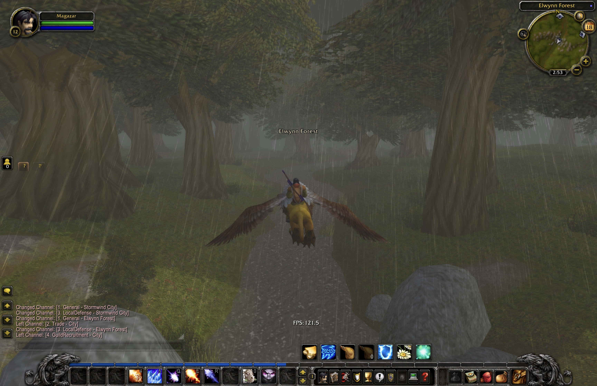
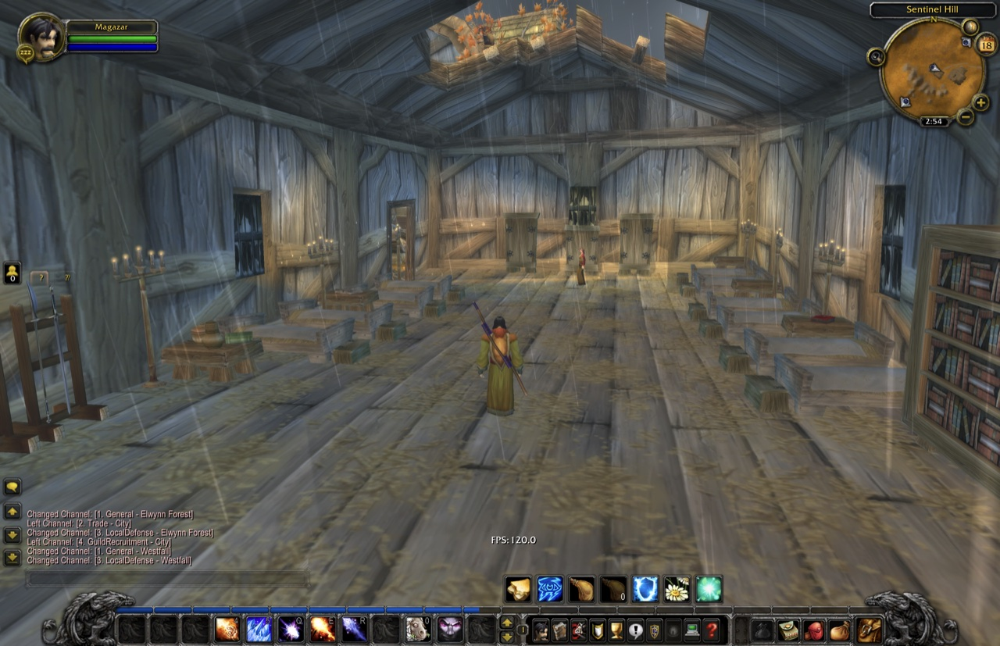

<p align="center">
  
</p>

<h1 align="center">WoW335 Launcher</h1>

<p align="center">
  A native macOS launcher &amp; manager for <b>World of Warcraft 3.3.5a</b> on <b>Apple Silicon</b> — ~120 FPS in a single self-contained app.
</p>

<p align="center">
  
  
  
  
  
  
</p>

<p align="center">
  <a href="https://hcnotes.cc/article/articles-my-own-private-azeroth"><b>Why and how I built this →</b></a>
</p>

---

## About

<p align="center">
  
  
</p>

Wrath of the Lich King–era WoW is a 32-bit x86 Direct3D 9 Windows game — about the worst possible match for an ARM Mac. This project wraps everything needed to run it *fast* into one `WoW335.app` bundle and puts a native SwiftUI manager in front of it:

| Layer | What it does |
|---|---|
| **CrossOver 26 wine** | runs the Windows client on macOS |
| **DXVK (async)** | translates Direct3D 9 → Vulkan → Metal |
| **winerosetta + rosettax87** | fast x87 FPU math under Rosetta 2 — the single biggest FPS win for 2010-era game code |
| **libSiliconPatch** | client-side hooks for Apple Silicon |
| **SwiftUI manager** (this repo) | install, patch, verify, configure, and launch — no terminal needed |

> [!IMPORTANT]
> CrossOver and WoWSilicon are needed **only while building** the wrapper — everything
> they provide is copied into the app bundle. Once `WoW335.app` is built, it is fully
> self-contained: both apps can be uninstalled, and updating or removing them later
> does not affect the wrapper.

The result on an M4 Max: **~120 FPS at native Retina resolution**, fast startup, fast exit.

**Why this exists:** for fun and discovery — making a 2010 Windows game run *great* on
modern Apple hardware is the whole point. This is not a piracy project: it ships no
game data, and it is built around the **original WoW 3.3.5a (build 12340) client**.
Modified or repacked clients might work, but they are untested and unsupported — if
one misbehaves, try a clean original client first.

<p align="center">
  
  
  
</p>

> [!IMPORTANT]
> **What's not in this repo:** the game itself, the wine stack, and the prefix live only inside the locally built app bundle. You need your own 3.3.5a client. This repo contains the launcher source and the build tooling.

## Using the launcher

Double-click **WoW335.app** — a native manager window opens:

- **Play** — one big button. Shows current mode/resolution/retina state, a one-click "re-detect display" refresh, a live *running* indicator with force-stop, and an **Install** button instead when no game is present.
- **Game** — install a client (pick a 3.3.5a client folder — it's copied in and patched for Apple Silicon automatically), **Verify** integrity (41 checks: files, patches, settings) with one-click **Fix Issues** repair, or a reinstall suggestion if game data is damaged beyond repair. Below: the **server list** editor (realmlist.wtf) — radio-select the active server, add or remove entries.
- **AddOns** — list installed addons (with versions from their .toc), install from ZIP or folder, remove to Trash, reveal in Finder. Blizzard built-ins are hidden.
- **Display** — window mode (maximized / windowed / fullscreen), automatic resolution & Retina matching at every launch, or pick a specific display: the game window is moved there automatically after launch (needs a one-time Accessibility permission).

**Cyrillic input** (tested on both ruRU and enUS clients): works out of the box — for ruRU clients always, and for enUS clients whenever your Mac has a Russian keyboard layout configured (the installer detects it and enables `CHAT_CP=1251` in `Contents/Resources/launcher.conf` automatically; set the key manually to force it either way). The fonts come from a ruRU client's own files, extracted and remapped at install time (requires `pip3 install mpyq fonttools`) — install a ruRU client once and its fonts are reused for any client afterwards.

Everything the GUI does is also scriptable — the same tools it calls live in `Contents/Resources/bin/`:

```sh
wow-settings show|auto|windowed|maximized|fullscreen|resolution WxH|retina on|off
wow-verify-game [--fix]
wow-install-client /path/to/client [Name]
wow-launch
```

## Building the wrapper

The app bundle is **built locally, not downloaded** — it embeds CrossOver's wine
stack, which cannot be redistributed. The build harvests its dependencies from
two apps you install first:

1. Get this repo: **Code → Download ZIP**, double-click to unpack (no git needed)
2. Install [CrossOver](https://www.codeweavers.com/crossover) (free trial is fine)
   into `/Applications` or `~/Applications` — source of the wine stack
3. Install [WoWSilicon **v2.5.5**](https://github.com/WoWSilicon/WoWSilicon/releases/tag/v2.5.5)
   next to it — **exactly v2.5.5** (the last release before 3.x; newer versions keep
   their payloads elsewhere and don't work as a file source). Launch it once and let
   it apply its patches before building — macOS will ask you to allow the app, and
   in some cases to allow it to modify other apps (Privacy & Security → App Management)
4. In Terminal, `cd` into the unpacked folder and run:
   ```sh
   make wrapper        # assembles ~/Applications/WoW335.app
   ```

New to the command line? [docs/BUILD-WRAPPER.md](docs/BUILD-WRAPPER.md) walks
through every step, Terminal included.

Contributors: [docs/INTERNALS.md](docs/INTERNALS.md) documents the wrapper
anatomy, the patch mechanisms, and the traps already discovered.

## Repo layout & building the launcher

| File | Installs to (inside WoW335.app) | Role |
|---|---|---|
| `main.swift` | `Contents/MacOS/WoW335` | the SwiftUI manager (single file) |
| `scripts/wow-launch` | `Contents/Resources/bin/` | game starter: env, auto-resolution, display mover |
| `scripts/wow-settings` | `Contents/Resources/bin/` | Config.wtf cvars, Retina mode, display detection |
| `scripts/wow-install-client` | `Contents/Resources/bin/` | copy a client in + apply the patch kit |
| `scripts/wow-verify-game` | `Contents/Resources/bin/` | 41-check verification with `--fix` repair |

```sh
./build.sh                     # compiles and installs into ~/Applications/WoW335.app
./build.sh /path/to/WoW335.app
make launcher                  # same thing, via make
```

Requires only the Xcode **Command Line Tools** (`swiftc` + macOS SDK). No Xcode, no dependencies.

## Troubleshooting

- **Something feels wrong with the game?** Open the **Game** tab and click
  **Verify** — it runs 41 checks over the client files, the Apple Silicon
  patches, and the settings, and offers **Fix Issues** for everything
  repairable in place.
- **Verify reports the game data itself is damaged** (or things stay broken
  after a fix): reinstall — click **Install New Game…** and point it at your
  client folder again. Installing always replaces the previous game and
  re-applies every patch from scratch. Your AddOns live inside the game folder,
  so re-add them after a reinstall.
- **Keyboard controls don't work / keybindings dead:** a Cyrillic keyboard
  layout is active — the game binds keys by character. Switch to a Latin
  layout for playing; switch to Russian only while typing in chat.
- **The game doesn't appear after Play:** it may have opened behind other
  windows — find the **WoW** icon in the Dock and click it to bring the game
  to the front.

## Credits

Standing on the shoulders of: [WoWSilicon](https://github.com/WoWSilicon/WoWSilicon), the winerosetta / rosettax87 projects, [DXVK](https://github.com/doitsujin/dxvk) and its macOS D3D9 forks, CrossOver/Wine, and the [ChromieCraft](https://www.chromiecraft.com) community.

World of Warcraft is a trademark of Blizzard Entertainment. This project contains no Blizzard assets or game data.

## License

[MIT](LICENSE)
