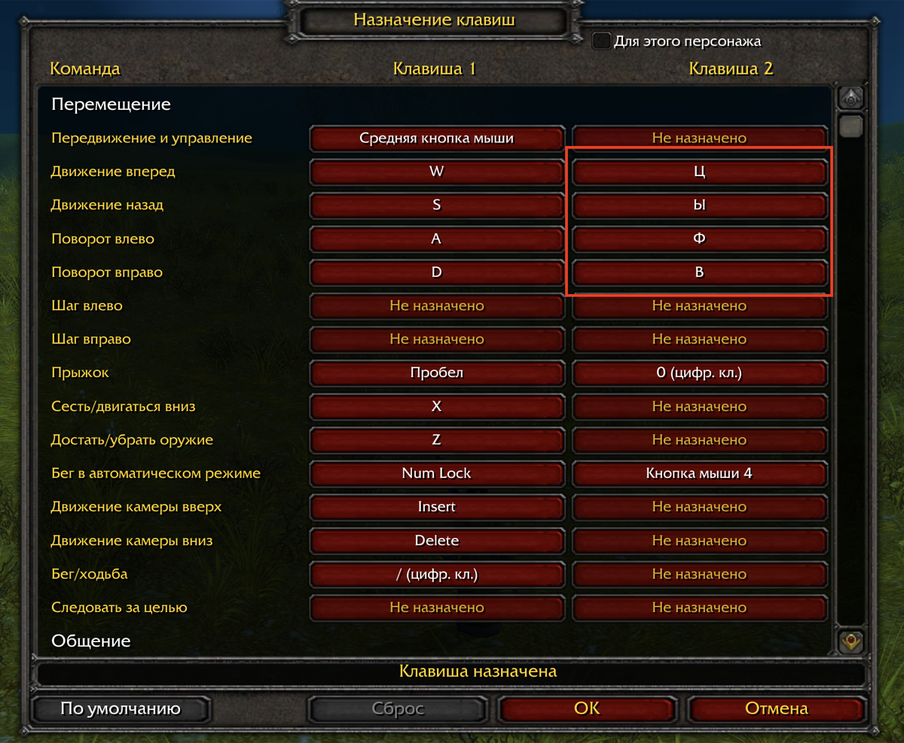

<p align="center">
  
</p>

<h1 align="center">WoW Launcher</h1>

<p align="center">
  A native macOS launcher &amp; manager for <b>World of Warcraft</b> on <b>Apple Silicon</b> — high performance in a single self-contained app, tuned for the <b>classic era</b> (3.3.5a, 2.4.3, 1.12) and happy to install anything else you point it at.
</p>

<p align="center">
  <a href="https://github.com/matasarei/wow-launcher/actions/workflows/ci.yml"></a>
  
  
  
  
  
  
</p>

<p align="center">
  <a href="https://hcnotes.cc/article/articles-my-own-private-azeroth"><b>Why and how I built this →</b></a>
</p>

---

## About

<p align="center">
  
  
</p>

Wrath of the Lich King–era WoW is a 32-bit x86 Direct3D 9 Windows game — about the worst possible match for an ARM Mac. This project wraps everything needed to run it *fast* into one `WoW.app` bundle and puts a native SwiftUI manager in front of it:

| Layer | What it does |
|---|---|
| **Wine 11 ([WineAndAqua](https://github.com/WineAndAqua/wine) build)** | runs the Windows client on macOS |
| **DXVK (async)** | translates Direct3D 9 → Vulkan → Metal |
| **winerosetta + rosettax87** | fast x87 FPU math under Rosetta 2 — the single biggest FPS win for 2010-era game code |
| **libSiliconPatch** | client-side speed hooks — on by default for the builds they were written for; drop them in Game → Patches if a server or a modified client objects |
| **SwiftUI manager** (this repo) | install, patch, verify, configure, and launch — no terminal needed |

> [!IMPORTANT]
> **This repo contains only the launcher source and the build tooling** — no game data,
> no wine stack. Nothing needs to be installed beforehand except the Xcode Command Line
> Tools: the build downloads the wine runtime and the patch payloads from
> [WoWSilicon](https://github.com/WoWSilicon/WoWSilicon)'s releases (checksum-verified)
> and bakes them into the app bundle. The finished `WoW.app` is fully self-contained;
> you bring your own client and install it through the app.
> Don't want to build? Every [release](https://github.com/matasarei/wow-launcher/releases)
> ships the same ready-to-use `WoW.app`.

**Requirements:** an Apple Silicon Mac running **macOS 15 or newer** — the floor set
by the embedded wine runtime; developed and tested on macOS 26. Any Apple Silicon
model qualifies (they all run macOS 15+). Uses **Rosetta 2** under the hood — macOS
offers to install it on first launch if it isn't already
(`softwareupdate --install-rosetta` does the same from Terminal). A major macOS
upgrade can remove it again; the launcher then says so and repeats that command.

The result on an M4 Max: **~120 FPS at native Retina resolution**, fast startup, fast exit.

**Why this exists:** for fun and discovery — making a 2010 Windows game run *great* on
modern Apple hardware is the whole point. This is not a piracy project: it ships no
game data, and it is built around **original classic-era clients** — WotLK 3.3.5a (12340),
TBC 2.4.3 and vanilla 1.12. Those are the ones that are tested, supported, and fast.

### Other clients

The launcher will install and start **any** client folder that has a game
executable and a `Data` folder — a repack, a custom build, a later expansion. It
fingerprints what you gave it (the executable's own version resource first, the
`Data` layout second) and applies only the patches that can physically work on
it; the **Game → Patches** menu shrinks to match, and a caption says why.

| What you install | What it gets |
|---|---|
| **3.3.5a (12340), 2.4.3, 1.12** | everything: DXVK, the mod loader, winerosetta, libSiliconPatch where a build exists, the icon patch, display matching, language packs |
| **A repack or custom build of those** | the same, minus anything keyed to a Blizzard executable (icon patch, language packs). libSiliconPatch is still offered unless the executable declares a build other than 12340 — its hooks are hardcoded 12340 addresses |
| **Cataclysm / MoP** (32-bit, still MPQ) | DXVK, the mod loader and winerosetta; **never** libSiliconPatch. Untested — no such client was available while building this |
| **WoD / Legion and later** (64-bit, CASC) | nothing. Every DLL in the patch kit is 32-bit x86 and cannot be loaded into a 64-bit process, so the client is copied in and started exactly as it shipped. The app tells you this and asks for confirmation **before** the copy — expect it not to run |

"Supported" still means the classic three. The rest is there because refusing
to try is worse than trying and saying honestly what happened.

**Not a WoWSilicon copy or fork:** [WoWSilicon](https://github.com/WoWSilicon/WoWSilicon)
is the upstream that makes the performance possible — this project gratefully reuses its
open-source building blocks (the wine runtime, winerosetta/rosettax87, the patch DLLs)
but builds a different thing with them. WoWSilicon is a patcher/launcher app that manages
games living elsewhere on your disk and a shared `~/.wine` prefix, with profiles for
several expansions. This is a **single-game appliance**: the client, the wine stack, a
private prefix, and all tooling live inside one `WoW.app` — nothing touches the rest
of your system, and deleting the app removes everything. On top sits its own SwiftUI
manager with things WoWSilicon doesn't do: integrity verification with one-click repair,
a realmlist editor, an addon manager, display targeting with automatic resolution/Retina
matching, the Cyrillic input layer, the fast-exit fix, and a proper "WoW" Dock identity.

<p align="center">
  
  
  
</p>

## Using the launcher

Double-click **WoW.app** — a native manager window opens:

- **Play** — one big button. Shows current mode/resolution/retina state, a one-click "re-detect display" refresh, a live *running* indicator with force-stop, and an **Install** button instead when no game is present.
- **Game** — install a client (pick any client folder — what it is gets detected, it's copied in, and it gets the Apple Silicon patches that apply to it, then it's verified), choose how much of the patch stack to apply (**Patches**: the menu lists only the levels this client can take), **Verify** integrity (client-aware checks: files, patches, settings — 43 of them for 3.3.5a) with one-click **Fix Issues** repair, or a reinstall suggestion if game data is damaged beyond repair. Below: the **language packs** (3.3.5a/2.4.3) — import a pack from a client in another language and switch the game language from a dropdown (the pack's data and matching executable are swapped, the cache cleared); and the **server list** editor (realmlist.wtf) — radio-select the active server, add or remove entries.
- **AddOns** — list installed addons (with versions from their .toc), install from ZIP or folder, remove to Trash, reveal in Finder. Blizzard built-ins are hidden.
- **Display** — window mode (maximized / windowed / fullscreen) with standard window sizes, automatic resolution & Retina matching at every launch, a renderer choice (**DXVK** by default or the Metal-native **MTLd3D** with HDR output), or pick a specific display: the game window is moved there automatically after launch (needs a one-time Accessibility permission).
- **About** — version, links (repository, build story, third-party components), license and trademark info.

**Cyrillic input** (tested on both ruRU and enUS clients): needs the Cyrillic **fonts from a ruRU client** — they are not bundled (they are Blizzard files), only the converter is. Install a ruRU client or import a ruRU **language pack** in the Game tab once; the app extracts the fonts from its MPQ archive, remaps them with the built-in native tool (nothing to install) and stashes them for any client afterwards, including enUS ones. With the fonts in place, ruRU clients type Cyrillic always, and enUS clients whenever your Mac has a Russian keyboard layout configured (the installer detects it and enables `CHAT_CP=1251` in `Contents/Resources/launcher.conf`; set the key manually to force it either way). The remap covers the whole CP1251 alphabet, so Ukrainian and Belarusian layouts type correctly too.

Everything the GUI does is also scriptable — the same tools it calls live in `Contents/Resources/bin/`:

```sh
wow-settings show|auto|windowed|maximized|fullscreen|resolution WxH|retina on|off
wow-client-profile [/path/to/client]    # what it is, and what applies to it
wow-verify-game [--fix]
wow-install-client /path/to/client
wow-launch
```

## Building the wrapper

The app bundle is **built locally with one command** — the build downloads the wine
runtime (~59 MB) and the patch payloads from WoWSilicon's GitHub releases,
verifies their checksums, and assembles everything:

1. Get this repo: **Code → Download ZIP**, double-click to unpack (no git needed)
2. In Terminal, `cd` into the unpacked folder and run:
   ```sh
   make                # assembles ~/Applications/WoW.app
   make install        # optional: move it to /Applications
   ```

New to the command line? [docs/BUILD-WRAPPER.md](docs/BUILD-WRAPPER.md) walks
through every step, Terminal included.

Contributors: [docs/INTERNALS.md](docs/INTERNALS.md) documents the wrapper
anatomy, the patch mechanisms, and the traps already discovered.
[docs/THIRD-PARTY.md](docs/THIRD-PARTY.md) lists every embedded component
with its license and source.

## Repo layout & building the launcher

| File | Installs to (inside WoW.app) | Role |
|---|---|---|
| `main.swift` | `Contents/MacOS/WoW Launcher` | the SwiftUI manager (single file) |
| `scripts/wow-launch` | `Contents/Resources/bin/` | game starter: env, auto-resolution, display mover |
| `scripts/wow-settings` | `Contents/Resources/bin/` | Config.wtf cvars, Retina mode, display detection |
| `scripts/wow-client-profile` | `Contents/Resources/bin/` | fingerprint a client and report which patches can apply to it |
| `scripts/wow-install-client` | `Contents/Resources/bin/` | copy a client in + apply the parts of the patch kit that fit it |
| `scripts/wow-verify-game` | `Contents/Resources/bin/` | client-aware verification with `--fix` repair |
| `tools/wow-client-fonts.swift` | `Contents/Resources/bin/wow-client-fonts` | native MPQ font extraction + CP1251 remap (no Python) |

```sh
make build          # the full wrapper (same as plain `make`)
make launcher       # just recompile the manager GUI + scripts into the existing wrapper
make install        # move the wrapper to /Applications
```

`make` is the only entrypoint — the helper scripts (like `build.sh`) are internal.
`make test` runs a hermetic test suite over the scripts (fake clients, stub wine — no
game data needed). Requires only the Xcode **Command Line Tools** (`swiftc` + macOS SDK).
No Xcode, no dependencies.

## Troubleshooting

- **Play does nothing, or the log says "Bad CPU type in executable":** Rosetta 2
  is missing — a major macOS upgrade can remove it. The Play screen says so; to
  put it back, run in Terminal:
  ```
  sudo softwareupdate --install-rosetta --agree-to-license
  ```
  Verify also reports it, and skips the two checks that need wine instead of
  failing them.
- **Something feels wrong with the game?** Open the **Game** tab and click
  **Verify** — it runs version-aware checks over the client files, the Apple Silicon
  patches, and the settings, and offers **Fix Issues** for everything
  repairable in place.
- **Verify reports the game data itself is damaged** (or things stay broken
  after a fix): reinstall — click **Install New Game…** and point it at your
  client folder again. Installing always replaces the previous game and
  re-applies every patch from scratch. Your AddOns live inside the game folder,
  so re-add them after a reinstall.
- **Cyrillic shows as "????" or garbage in an enUS game:** the authentic
  Cyrillic fonts come only from ruRU client files — import a ruRU
  **language pack** in the Game tab (or install a ruRU client) once. Its
  fonts are extracted, stashed, and reused for any client afterwards,
  including enUS.
- **Cyrillic typed after switching layouts shows as `ôûâ` / `³`:** the fonts
  in `<game>/Fonts/` are not the remapped ones (hand-copied, or from an older
  launcher). Reinstall the ruRU client or re-import its language pack — the
  stash is refreshed automatically.
- **Keyboard controls don't work with a Cyrillic layout active:** the game
  names keys by the active layout — with a Russian layout the W key is "Ц",
  so the default `W`/`S`/`A`/`D` bindings go dead (the client does the same
  on Windows). Bind the Cyrillic letters as **Key 2** for the actions you use
  (Ц/Ы/Ф/В next to W/S/A/D) and both layouts work — no more switching to type
  in chat:

  
- **Stuck at "Connecting" on a local-network server** (a `192.168.x.x` /
  `10.x.x.x` / `.local` address): macOS asks for local-network access on
  behalf of the launcher — the game runs as its child. Open **Game → Server**
  and click **Test Connection**: macOS asks right away; allow it, then quit
  and reopen both the launcher and the game. The result under the button says
  whether the server was reached, or that macOS is blocking access. The
  permission belongs to the launcher, so it keeps running while you play —
  hidden, with no window or Dock icon — and quits by itself when you exit the
  game; on macOS 27 the game loses the connection if it quits earlier. So keep
  **Close the launcher when the game starts** (Play screen) unchecked, the
  default. Every rebuilt, renamed or moved copy of the app is a new app to
  macOS and has to be allowed again. Run the app from `Applications` (not
  `Downloads`): for unsigned apps macOS silently blocks a copy it doesn't
  recognize. If it still won't connect, open **System
  Settings → Privacy & Security → Local Network**, toggle **WoW** off and on,
  and relaunch both. Internet servers are unaffected — this is LAN-only.
- **Sound stays on the old device after switching audio output** (e.g. Mac
  speakers → AirPods): the game follows the macOS output device within a few
  seconds (wine runtime r15+) — no restart needed. If it doesn't, check that
  the device is the **default** output in System Settings → Sound; the game
  follows the default, not a device picked in another app. Wrappers built
  before r15 need a rebuild.
- **Stutter or uneven frame pacing in Low Power Mode** (also on a fast Mac —
  seen on an M4 Max with both renderers): macOS caps the display at 60 Hz and
  throttles the GPU, and an unlocked frame rate paces badly against that.
  Turn on **Vertical Sync** in the game's Video options — a solid 60 FPS, smooth.
- **The game doesn't appear after Play:** normally the launcher waits for the
  game window and brings it to the front automatically. If you switched to
  another app while the game was loading, it stays in the background by
  design — find the **WoW** icon in the Dock and click it.

## Credits

Standing on the shoulders of: [WoWSilicon](https://github.com/WoWSilicon/WoWSilicon), the [WineAndAqua](https://github.com/WineAndAqua/wine) wine build, the winerosetta / rosettax87 projects, [DXVK](https://github.com/doitsujin/dxvk) and its macOS D3D9 forks, Wine/CrossOver, and the [ChromieCraft](https://www.chromiecraft.com) community.

World of Warcraft is a trademark of Blizzard Entertainment. This project contains no Blizzard assets or game data.

## License

[MIT](LICENSE)
